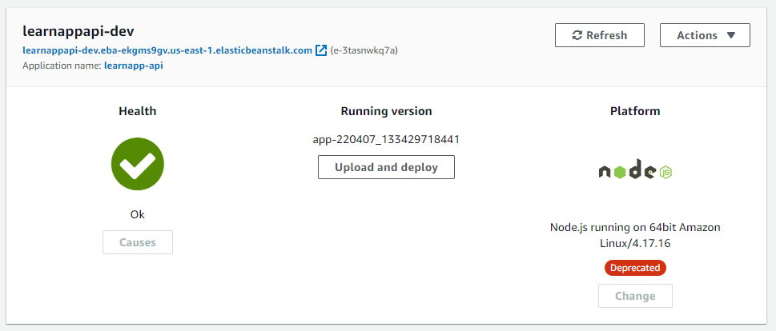
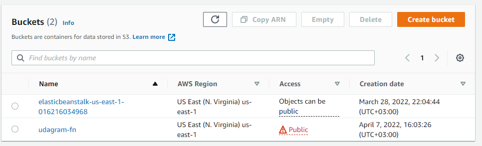
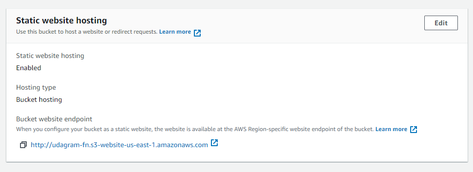
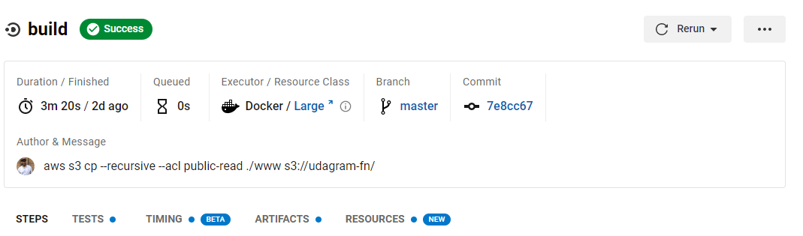
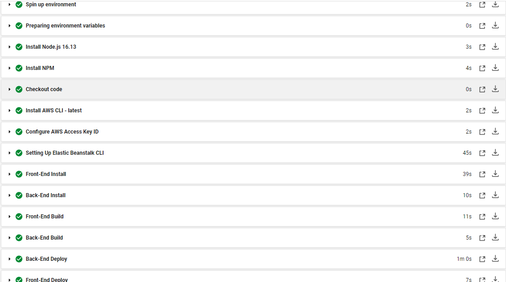
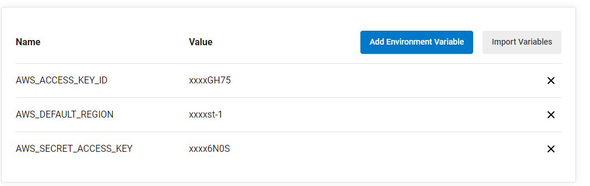

# Udagram

## The deployment Project Udacity Back-end Course

The Frontend Link

```sh
http://udagram-fn.s3-website-us-east-1.amazonaws.com/
```

The Backend Link

```sh
http://learnappapi-dev.eba-ekgms9gv.us-east-1.elasticbeanstalk.com/
```

The Services Used For Create The Inferstrucre Of The Deployment

- AWS RDS
- AWS ES2
- AWS S3
- Circle CI

## RDS

The RDS Used for hosting the postgres database


## EC2

The EC2 Used to hosting the Node js backend web server



## S3

S3 used as storage to host the frontend static website and to storage the files



## Circle CI

Circle CI used for pipeline and it connected to my github repo  



